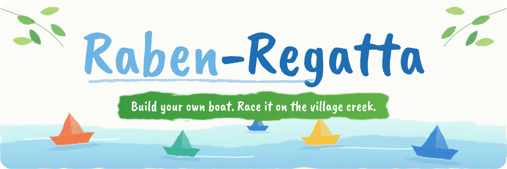
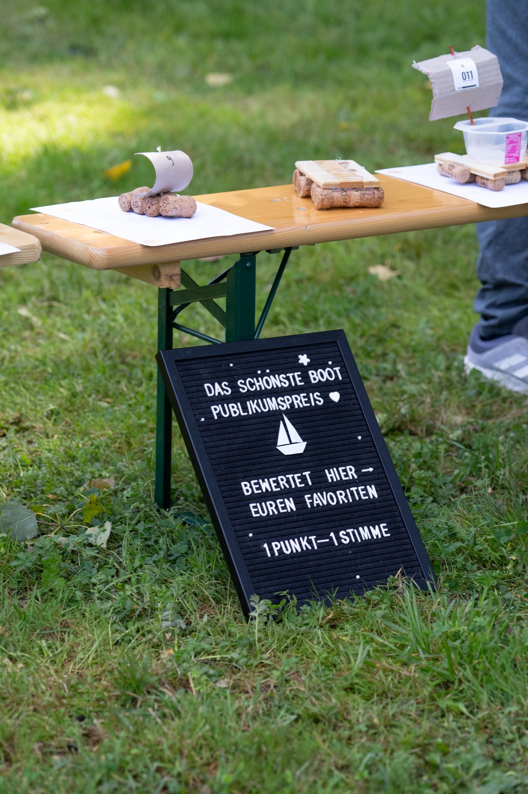
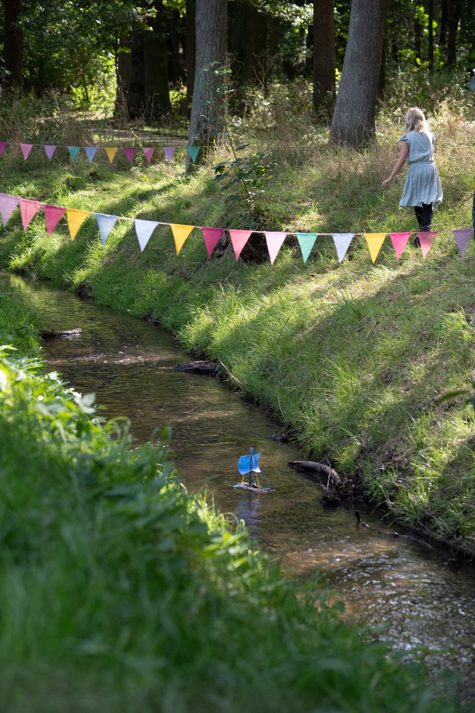
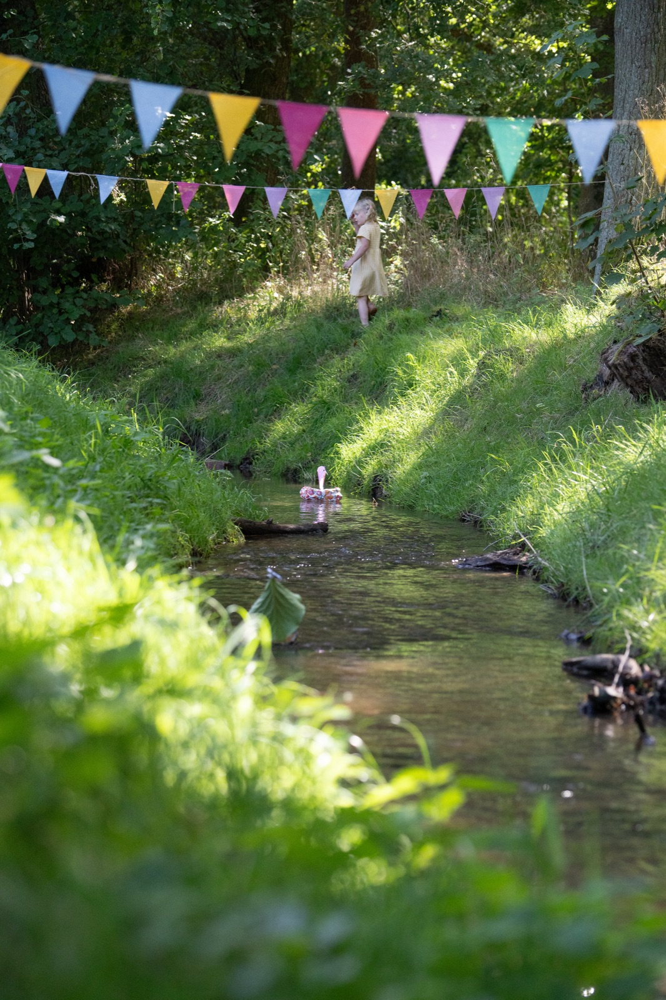

<p align="center">
  
</p>

<p align="center">
  <a href="LICENSE.md"></a>
  <a href="https://github.com/Pixeldieb/Rabenregatta/wiki"></a>
  
  
  <br>
  
  
  
  
  
  <br>
  
  
  
</p>

<p align="center">
  
</p>

Rabenregatta ("raven regatta") is a small community event. Children, young people, families and adults each build a boat that fits on **one sheet of A4 paper**. They use **reused and planet-friendly materials**. Then all boats race down a local creek.

It sounds simple, and it is. The point is not really the boat. The point is the moment someone watches **their own** boat float and thinks: *"I made that. I can do things."* Psychologists call this **self-efficacy**. It is one of the strongest predictors of whether people try new things, keep going and get involved in their community ([Bandura, 1977](wiki/Sources.md#bandura-1977)).

This repository is an **open kit**. Use it to run a Rabenregatta in your own village.

---

## The idea in 30 seconds

| | |
|---|---|
| 📄 **Boat size** | Must fit on a DIN A4 footprint (21 × 29.7 cm). No height limit: physics sets it |
| ✋ **Who builds** | You. No kits, no downloaded plans, no last year's boat |
| ♻️ **Materials** | Reused or natural. No Styrofoam, no glitter, no batteries |
| 🌊 **Power** | Only the creek and the wind |
| 🏁 **Race** | Heats of three in registration order, timed, with sponsor chicanes |
| 🏆 **Prizes** | Many kinds: fastest, slowest, heaviest, tallest, audience favourite and more |
| 🍦 **Cost** | Free for everyone aged 0–18, with an ice cream for every child |
| 🧹 **Rule no. 1** | Every boat and every piece comes back out of the water |

---

## A race day in pictures

<table>
  <tr>
    <td width="50%" valign="top">
      
      <br><strong>The gallery.</strong> Registered boats wait here with their number until their race. The audience votes for their favourite.
    </td>
    <td width="50%" valign="top">
      
      <br><strong>The start.</strong> Three boats per heat, released at the start board.
    </td>
  </tr>
  <tr>
    <td width="50%" valign="top">
      
      <br><strong>The race.</strong> Only the creek and the wind move the boats. Builders follow them along the bank.
    </td>
    <td width="50%" valign="top">
      
      <br><strong>Every boat is different.</strong> Rafts, sailboats, even a swan. Many prizes mean many ways to win.
    </td>
  </tr>
</table>

---

## Where to start

| I want to... | Go to |
|---|---|
| Understand why this works | [Why Rabenregatta?](wiki/01-Why-Rabenregatta.md) |
| Plan an event | [Planning timeline](wiki/02-Planning-Timeline.md) |
| Read the rules | [Official rules](rules/official-rules.md) · [Rules at a glance](rules/rules-at-a-glance.md) |
| Learn how to build a boat | [Tutorials](tutorials/README.md) |
| See everything we need | [Bill of materials](checklists/bill-of-materials.md) |
| Pack the tool and material boxes | [Eurobox system](wiki/06-Eurobox-System.md) |
| Run registration and the race office | [Registration and race office](wiki/17-Race-Office.md) |
| Build the race equipment | [Tournament equipment](wiki/07-Tournament-Equipment.md) |
| Involve local businesses | [Sponsors and chicanes](wiki/14-Sponsors-and-Chicanes.md) |
| Keep it free and fair | [Money and fairness](wiki/15-Money-and-Fairness.md) |
| Document the boats | [Documenting the boats](wiki/16-Documenting-the-Boats.md) |
| Promote the event | [Marketing templates](marketing/) |
| Print forms and checklists | [Templates](templates/) · [Checklists](checklists/) |
| Find the science | [Sources](wiki/Sources.md) |
| Make posters and signs in our look | [Design guide](assets/brand/README.md) |

> [!TIP]
> The full handbook is in the **[Wiki](https://github.com/Pixeldieb/Rabenregatta/wiki)**. Its source files are in the [`wiki/`](wiki/Home.md) folder. Edit them there, and every change is published to the Wiki automatically.

---

## Make it yours

This kit is a starting point, not a recipe you must follow. Your creek, your village and your people are different. Change the rules, the age groups and the prizes. The only things we ask you to keep:

1. **Self-built.** The experience only works if the boat is really yours.
2. **Leave no trace.** Nothing stays in the creek.
3. **Everyone gets a moment of success.** There are prizes for more than just speed.
4. **Free for children.** Taking part never costs anything for anyone aged 0–18.

---

## Repository map

```text
Rabenregatta/
├── README.md              ← you are here
├── wiki/                  ← the handbook: why, how, when (published to the Wiki tab)
├── rules/                 ← official rules + one-page version for kids
├── tutorials/             ← boat-building basics + design examples
├── templates/             ← forms, score sheets, budget, survey
├── checklists/            ← bill of materials, packing lists, race day, after the event
├── marketing/             ← poster text, press release, social posts, letters
├── gallery/               ← online boat gallery and records board
├── assets/                ← design guide, header, photos, drawings
├── scripts/               ← helper that publishes wiki/ to the GitHub Wiki
├── CONTRIBUTING.md        ← how to share your improvements
├── CODE_OF_CONDUCT.md
└── LICENSE.md
```

Everything is written in **Markdown** (`.md`). You can edit it in any text editor, in [Obsidian](https://obsidian.md), in VS Code or directly on GitHub. To make printable documents, open a file in LibreOffice, or convert it with [Pandoc](https://pandoc.org): `pandoc rules/official-rules.md -o rules.pdf`.

## Share back

Did you run a Rabenregatta? Did you find a better start board or a clever material trick? Please tell us. See [CONTRIBUTING.md](CONTRIBUTING.md).

## License

Content is licensed under [CC BY-SA 4.0](LICENSE.md). You may copy, change and share it, including for commercial use. Please name the source and share your changes under the same license.

Photos: **Luise Worms, lumography**, and the Raben-Regatta team, see [photo credits](assets/images/events/kayna/CREDITS.md). The photos are **not** covered by the CC license. Please ask before reusing them.
