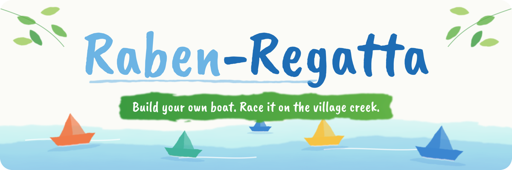

# Rabenregatta Design Guide

The look of Rabenregatta comes from our event poster: **light, hand-made, watercolour, paper boats on a creek.** It should feel like a summer afternoon in the village, not like an advertisement.



## Colours

| | Name | Hex | Use |
|---|---|---|---|
|  | **Sky blue** | `#6CB4E4` | First part of the title ("Raben"), water, light accents |
|  | **Creek blue** | `#1E6DB5` | Second part of the title ("Regatta"), headings, links |
|  | **Night blue** | `#1F2A5C` | Body text on posters: date, place, times |
|  | **Meadow green** | `#3B9A3F` | Label bands (white text on green), buttons, "go" |
|  | **Leaf green** | `#62B246` | Leaves, light green accents |
|  | **Mint water** | `#BDEFF0` | Water surfaces, soft backgrounds |
|  | **Paper white** | `#FBFBF7` | Background. Lots of it |
|  | **Boat orange** | `#F07A4A` | Boats, small highlights |
|  | **Boat yellow** | `#F6C343` | Boats, small highlights |
|  | **Boat teal** | `#3FB39B` | Boats, small highlights |

**Rule of thumb:** mostly paper white and blues, one green band, a few colourful boats. The boat colours are accents, never large areas.

## Fonts

| Use | Font | Where to get it |
|---|---|---|
| **Titles and labels** | **Caveat Brush** (hand-painted brush style) | [Google Fonts](https://fonts.google.com/specimen/Caveat+Brush), free (SIL Open Font License) |
| **Body text** | **Nunito** (round, friendly, easy to read) | [Google Fonts](https://fonts.google.com/specimen/Nunito), free (SIL Open Font License) |

Both work in LibreOffice, Canva, Inkscape and on the web. Install them once on the computer you make posters on.

Use Caveat Brush **only for short texts**: titles, labels, one-line slogans. Everything longer than a line goes in Nunito.

## Elements

- **Title:** "Raben-Regatta" in Caveat Brush, "Raben" in sky blue, "-Regatta" in creek blue, with a thin hand-drawn underline.
- **Label band:** a green brush stroke with white text, e.g. the slogan or "Free for kids!".
- **Paper boats:** simple origami boats in orange, yellow, teal and blue, floating on watercolour water.
- **Leaves:** a few green leaves in the upper corners.
- **Watercolour:** soft, uneven edges. Nothing sharp, nothing glossy.
- **Photos:** real boats and real people from our events. Natural light. No stock photos.

## Do and don't

| ✅ Do | ❌ Don't |
|---|---|
| Lots of white space | Crowded posters |
| Soft watercolour edges | Hard shadows, gradients, 3D effects |
| Real photos of boats | Stock photos |
| Black rope or black tape for barriers | Red-white warning tape (it clashes with the look) |
| Bunting in the event colours | Plastic balloons, glitter |
| Sponsors in one line, same size | Big logos |

## Files

| File | Use |
|---|---|
| [`header.svg`](header.svg) | Header for the README, websites, presentations. The title is converted to shapes, so no font is needed |
| [`header.png`](header.png) | Same as PNG, 1200 × 400, for places that don't show SVG |

The header is generated with a small script, so text and colours can be changed. The fonts are licensed under the SIL Open Font License, which allows this use.

## Badges

The badges at the top of the README use the colours above. To add one, use [shields.io](https://shields.io) with a colour from the table (without `#`), for example:

```markdown

```
