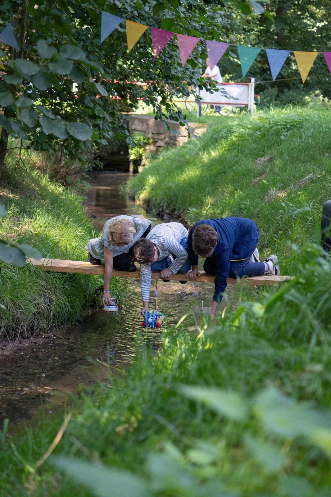

# Tournament Equipment

The race equipment is simple and mostly made of wood. You can build it in an afternoon with a local carpenter or DIY-savvy volunteers. Build it once and use it for years, or lend it to other villages.

## Overview

| Item | Purpose |
|---|---|
| **A4 gauge** | Checks the boat size |
| **Start board** | Builders kneel on it and drop their boats on the signal (hand start) |
| **Finish board** | Marks the finish line clearly |
| **Catch net** | Catches every boat after the finish. **Mandatory** |
| **Raven sticks** | Long poles for builders to free their stuck boat from the bank |
| **Test harbour** | A tub of water for test floats before the start |
| **Stakes and straps** | Hold the boards in place |
| **Chicanes** | Themed obstacles, provided by sponsors. See [Sponsors and chicanes](14-Sponsors-and-Chicanes.md) |
| **Kitchen scale and ruler** | Weigh and measure every boat at registration |
| **Photo station** | Document every boat. See [Documenting the boats](16-Documenting-the-Boats.md) |
| **Stopwatches** | Race time of every boat |
| **Talers and voting containers** | Audience vote |

## A4 gauge

The gauge checks the rule: the boat must fit on an A4 footprint. There is no height limit, but the height is measured and recorded.

**Build:**

- A base board with a **frame whose inner size is exactly 210 × 297 mm**. Use 4 thin battens screwed onto the board.
- A **measuring post**: a vertical batten with a centimetre scale, to measure the height quickly.

**Check:** Place the boat in the frame. If it fits without touching the outside of the frame, it passes. Overhanging parts (sails, bowsprits, outriggers) count too. Seen from above, everything must be inside the A4 rectangle.

Tip: Make two or three gauges so the check at registration goes quickly.

## Start board

**The standard is a hand start.** The three builders of a heat kneel on the start board, hold their boats above the water and, on the signal, simply **let them drop**. That's all.

  
   <em>Hand start: three builders kneel on the start board and let their boats drop on the signal.</em>

Why a hand start?

- **Super simple.** No mechanism that can jam, no extra helper.
- **No contact with the water.** Builders only let go; nobody reaches into the creek.
- **The builders start their own boat.** That's a big moment for them.

**Rules at the start:**

- Hold the boat above the water, let it drop on "go". **Only dropping**: no pushing, no throwing, no hands in the water.
- All three boats are dropped at the same moment.
- If a boat lands upside down, it's part of the race. It can use its one rescue.

**The board must carry three kneeling children.**

- A thick, stable plank (spruce or larch, at least 40–50 mm thick, 25–30 cm wide), or two planks side by side screwed onto cross battens. Length: creek width + 1 m, with at least 50 cm resting firmly on each bank.
- Secured with stakes so it can't rock or slide. Test it with the weight of two adults before the event.
- As low above the water as possible, so boats don't drop too far.
- At a spot where the creek is shallow and the banks are flat.
- One adult stands next to the start board during every heat.
- Optional: mark three **drop spots** on the board with paint (1, 2, 3).

### Variant: start gate

If boats should wait in the water and start without anyone touching them, you can add a **release gate**: a thin batten hanging from the upstream side of the plank into the water on hinges or cord loops. Boats wait behind it; a pull cord lifts the gate, and all boats start together. It needs an extra helper and more building work, which is why we use the hand start.

## Finish board

A second plank across the creek at the end of the course. It does not touch the water.

- Paint a clear **finish line** (a white or coloured stripe) on the upstream edge.
- Optional: hang a light string with small flags just above the water to mark the line.
- Two **finish judges** stand on the bank at the line. They decide the order. With a phone video on slow motion, you can settle close finishes.

## Catch net

The catch net makes sure **nothing leaves the course**. It is mandatory.

- Place it 5–10 m below the finish, where the water is calm.
- Use a fine net (for example an old football goal net, garden or fruit tree net), fixed to stakes on both banks.
- Set it at an **angle** to the current, so boats drift to one bank where a helper can pick them up.
- The net should reach the ground but should **not block the creek**. Water, leaves and small animals must be able to pass through or under it.
- **Remove the net right after the race.** Do not leave it overnight, because animals can get caught.

Backup: a second helper with a landing net a few metres below the catch net.

## Raven sticks

Poles about 1.5–2 m long, with a soft end (for example old cloth wrapped tightly and tied with string, or a firmly fixed old tennis ball). **Builders** use them to free or set upright their own boat once per race, **from the bank**. Course helpers hand them out and take them back. Have at least 3, one per boat in a heat, and keep them light enough for children.

## Test harbour

A big tub, a mortar trough or a paddling pool, half full of water. Builders test their boats before the race: does it float, does it stay upright? Place it near the start.

## Scale, ruler and photo station

At registration, every boat is **weighed** (kitchen scale, 1 g steps, up to 5 kg) and **measured** (height from the lowest to the highest point). The values go into the [boat register](../templates/boat-register.md) and count for prizes like Heavyweight or Skyscraper. Right next to it is the photo station. See [Documenting the boats](16-Documenting-the-Boats.md).

## Talers and voting containers

For the audience vote, see [Race format](08-Race-Format.md#the-audience-vote-gold-and-silver-talers).

- **Talers:** wooden discs, about 3–4 cm across. Paint one batch gold and one batch silver with water-based paint. You need one per participant and one per expected spectator, plus 20% extra.
- **Voting containers:** one per boat. Jars, tins or small boxes, each with a large start number. Reuse them every year and just swap the number cards.
- Store talers and containers in the black Eurobox.

## Chicanes

Chicanes are provided by sponsors and must meet the [chicane rules](14-Sponsors-and-Chicanes.md#rules-for-every-chicane). The creek team plans where each one goes, checks it at the test run, and removes it with the sponsor on the same day. Leave enough distance between chicanes (at least 5 m) so the spectators can follow each one.

## About the boards

The **finish board** is a line, not a bridge. Nobody stands on it. The **start board** is built to carry three kneeling children (see above), but it is not a footbridge for crossing the creek.

If you want a **footbridge for people** to cross the creek:

- Ask a carpenter or the fire brigade to build and check it.
- Use handrails and a non-slip surface.
- Set a maximum number of people.

## Storage

- Dry the wood after use. Store it off the ground, protected from rain.
- Keep a small spare-parts bag: screws, cord, a spare hinge.
- Label everything with "Rabenregatta" and the owner.

## Materials list and costs

All items with quantities are in the [bill of materials](../checklists/bill-of-materials.md#5-race-course). See the [budget template](../templates/budget.md) for costs. Many parts can be borrowed or donated: planks from a sawmill, nets from the sports club, stakes from the garden centre.
