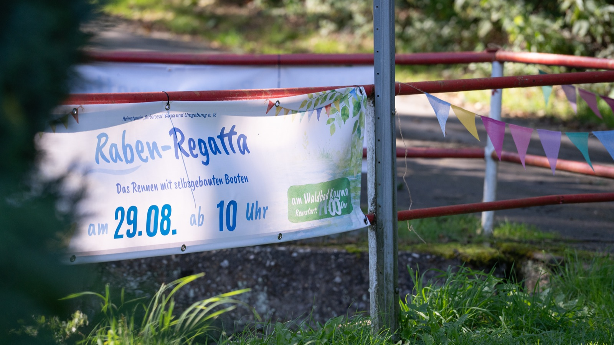

# Marketing and Community

In a village, word of mouth is your strongest channel. Marketing for Rabenregatta means asking people to **take part**, not just to come and watch.

## Key message

> **Build your own boat. Race it on our creek. Discover what you can do.**

Everything else is detail. Always mention: **date, place, A4, reused materials, free for kids and teens, ice cream**.

## Our look

  
   <em>Our event banner: watercolour, paper boats, blue title, green label band.</em>

All posters, flyers, signs and banners follow the look of our event poster: watercolour, paper boats, blue title, green label band, lots of white space. Colours, fonts and files are in the [design guide](../assets/brand/README.md).

## Channels that work in villages

| Channel | How | Template |
|---|---|---|
| **Posters** | Bakery, shop, town hall, bus stop, school, kindergarten | [Poster text](../marketing/poster-text.md) |
| **School and kindergarten** | Letter to head teachers; offer a workshop during school time | [Letter to schools](../marketing/letter-to-schools.md) |
| **Village newsletter / local paper** | Announcement 6 weeks before, report afterwards | [Press release](../marketing/press-release.md) |
| **Clubs** | Fire brigade, sports club, local history club, church, youth club | Talk to them in person |
| **Social media / messenger groups** | Village WhatsApp, Facebook group, Instagram | [Social media posts](../marketing/social-media-posts.md) |
| **Material collection boxes** | A decorated box "Treasures for Rabenregatta" at school and in the shop | The box itself is advertising |
| **Local radio** | Short interview with a child builder | |

## Material collection as a campaign

Start collecting **8 weeks** before the event. It gets people involved early, long before race day.

- Set up collection boxes in public places. Label them clearly with the [traffic light](05-Materials-Traffic-Light.md): *"We collect: corks, clean cartons, bottles, wood offcuts. No Styrofoam."*
- Post photos of the growing pile.
- Ask local businesses for offcuts and name them as supporters.

## Sponsors

Local businesses become part of the race: each sponsor gives a prize, chooses its win condition and builds a themed chicane. See [Sponsors and chicanes](14-Sponsors-and-Chicanes.md) and the [letter to businesses](../marketing/letter-to-businesses.md).

## Partners and supporters

| Partner | What they can give |
|---|---|
| Carpenter, joiner, sawmill | Wood offcuts, help building the equipment |
| Fire brigade | Safety at the creek, a tent, a PA system |
| School, kindergarten | Workshops, participants, rooms |
| Local history club | Knowledge of the creek, stories, cake |
| Bakery, café | Food, corks, cartons |
| Municipality | Permission, insurance, publicity |
| Local businesses | A prize, a chicane, a workshop with their team |
| Ice cream vendor | Ice cream for every child, settled via vouchers |

Name supporters on posters and at the award ceremony. Don't make it a sponsor show; keep the focus on the builders.

## Photos and videos

- Ask for **consent** at registration. See [photo consent template](../templates/photo-consent.md).
- Give people who do not want to be photographed a coloured sticker or wristband.
- Photograph boats, hands and tools. These often make the best pictures and avoid privacy issues.

## After the event

- Send a report with photos to the local paper within 2 days.
- Post the results and thank everyone.
- Share your event report in this repository. See [CONTRIBUTING](../CONTRIBUTING.md).
